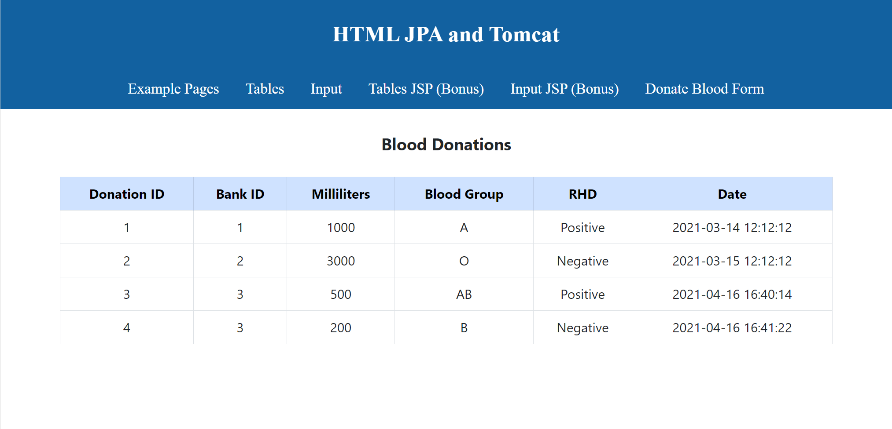
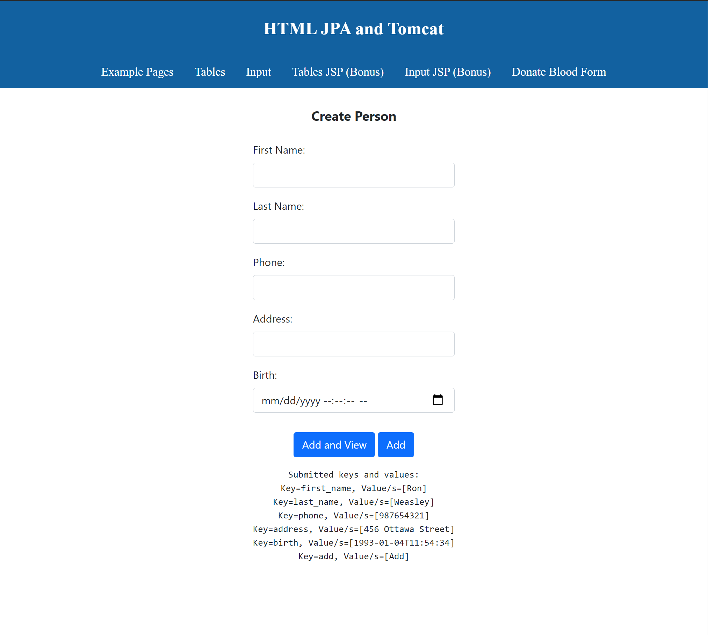
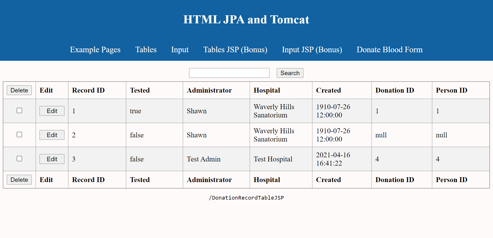
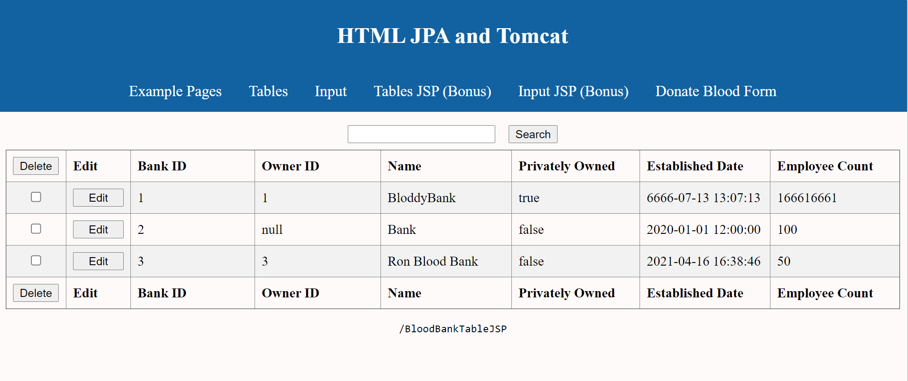
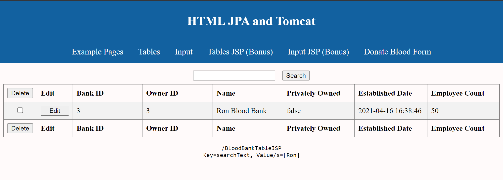
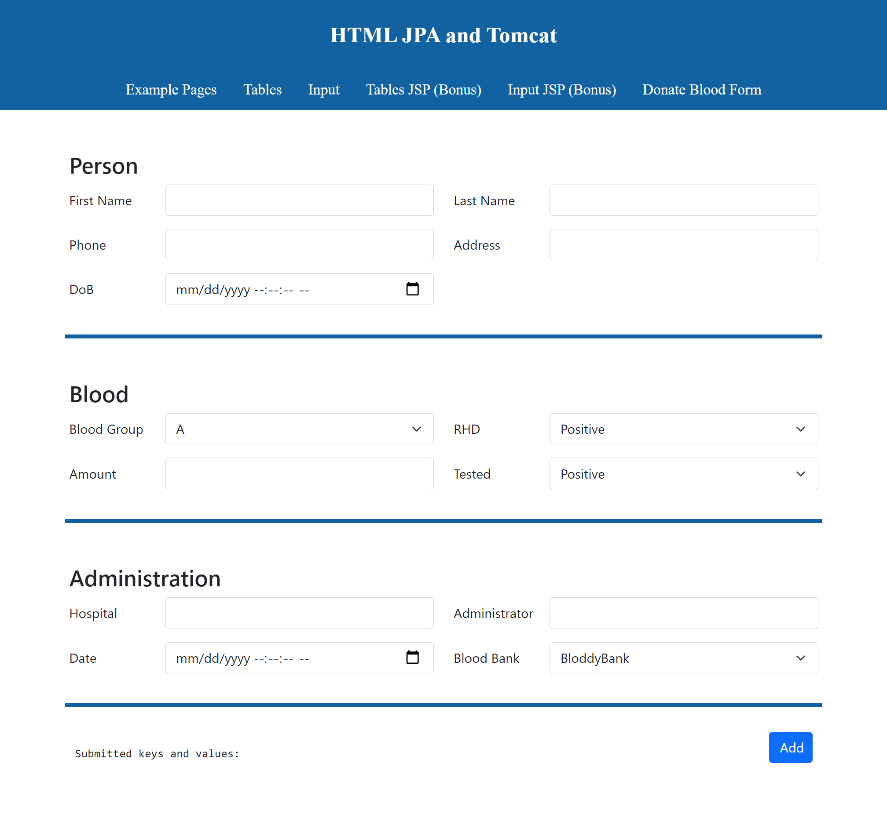

## SimpleBloodBank
### Assingment 2 of Object Oriented Programming With Design Pattern. 
#### For this assignment, we are implementing DAO pattern, Hibernate ,JSP etc, theroy to interact with database. 

- Displayed all data of each table in a form format in a web page.
- Users are able to search the data from table, edit as well as delete the data from database.
- Used DAO Design Pattern, Hibernate, JSP theory to interact with database.    
- Used HTML, CSS, Bootstrap to design the web page.

#### Here is a brief explaination of what we have done in the project.

https://user-images.githubusercontent.com/39057315/115084457-f37a4a80-9ed6-11eb-8ea5-85e9a28779e4.mp4

#### Here are screenshots of web pages.

##### 1. Display Blood Donation table without JSP.

##### 2. Insert a new row to Person table.

##### 3. Display Donation Records table with JSP.

##### 4. Display Blood Bank table with JSP.

##### 5. Search Blood Bank table.

##### 6. Blood Donate Form page - by filling up this form, users are inserting a new row to Person table, Blood Donation table and Donation Record table respectively.

